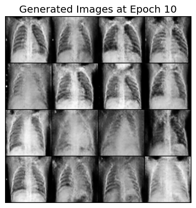
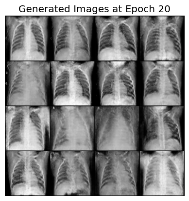
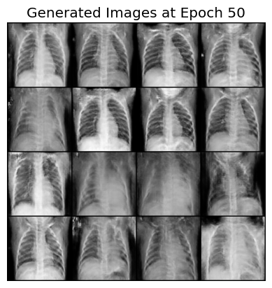
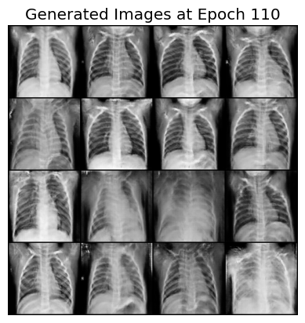
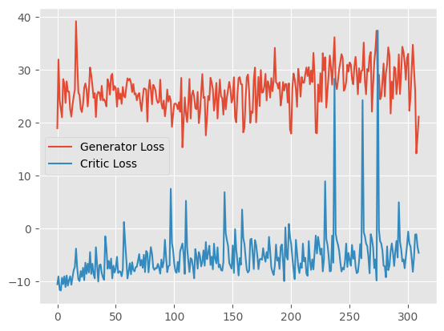

## WGAN for Chest X-Ray Image Generation
This project implements a Wassertstein Generative Adversarial Network (WGAN) with Gradient Penelty to generate synthetic chest X-ray images

### Results
- **Sample synthetic images**:

- **Loss curves for generator ad discriminator**:
